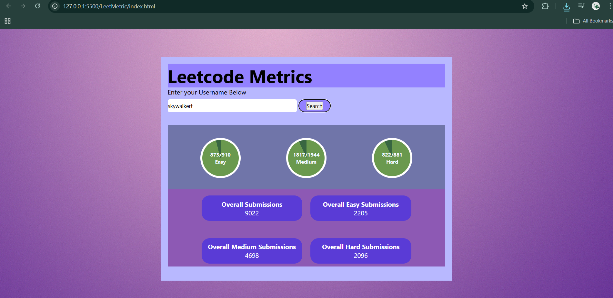

# ⚡ AlgoStats – LeetCode Metrics Dashboard

A sleek and responsive web app that fetches and visualizes **LeetCode user statistics** in real-time.  
Built with **HTML, CSS, and vanilla JavaScript**, AlgoStats dynamically displays profile data, coding metrics, and performance insights — all in an elegant dashboard UI.

---

## 🌐 Live Demo  
🔗 [View Project Demo](#) *(Add your live link here once deployed)*

---

## 📸 Preview
  
*Dynamic user metrics visualization with responsive cards.*

---

## 📋 Features

- 🔍 **Username Search:** Enter any LeetCode username to fetch their public data.
- ⚡ **Instant UI Updates:** Dynamic rendering of profile and metric cards directly in the DOM.
- 🌐 **Asynchronous Fetching:** Uses `fetch()` API for real-time data retrieval.
- 🧩 **Error Handling:** Gracefully handles invalid usernames and network issues.
- 🌀 **Loading Indicators:** Smooth feedback while data loads.
- 📱 **Responsive Design:** Optimized for desktop and mobile devices.
- ✨ **Interactive UX:** Highlighted results, transitions, and animated UI elements.

---

## 🛠️ Tech Stack

| Technology | Description |
|-------------|-------------|
| **HTML5** | Semantic and structured layout |
| **CSS3** | Responsive styling with Flexbox and Grid |
| **JavaScript (ES6+)** | DOM manipulation, async fetching, error handling |

---

## 🚀 Getting Started

### 1. Clone the Repository
```bash
git clone https://github.com/your-username/algostats.git
cd algostats

```
### 📂 Project Structure

AlgoStats/
├── index.html          # Main HTML file
├── style.css           # Styling and layout
├── script.js           # Core JavaScript logic
├── assets/             # Images and icons
└── README.md           # Documentation

### 🧠 How It Works

1.The user enters a LeetCode username into the search bar.
2.The app sends an asynchronous request to fetch profile data.
3.The returned JSON data is dynamically rendered into the DOM.
4.Error and loading states provide instant feedback and smooth UX.

### 💡 Future Enhancements

📊 Add data visualization (e.g., Chart.js for problem stats)
🧮 Allow multiple user comparisons
🗂️ Integrate contest and submission histories
🌙 Add dark/light mode toggle

🧑‍💻 Author

Vishnu S
💼 Front-End Developer | Focused on clean UI & seamless user experience

